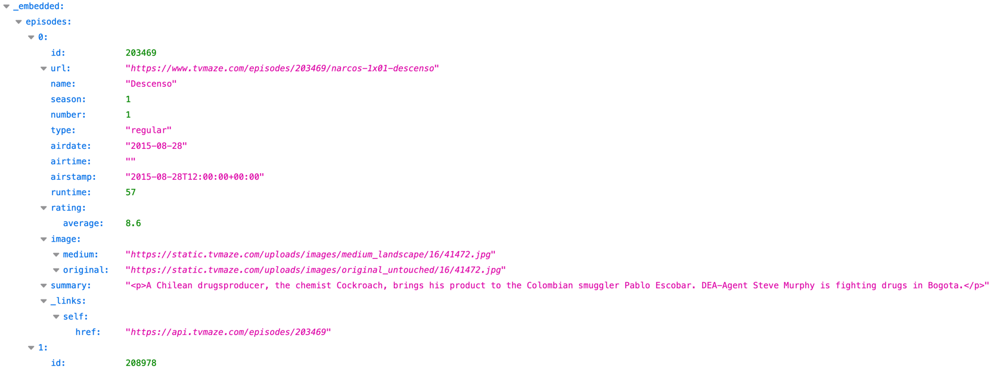
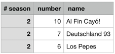

CSV + JSON Cruncher - query and process your CSV and JSON files using SQL.
===================================================================

A tool which treats CSV and JSON files as SQL tables, performs SQL `SELECT` queries on them,
and stores the result into CSV and JSON files.


<!--
! [icon](/docs/images/icon.png)
http://static.openheatmap.com/images/googleicon.png
-->

Many tools and systems can export their data to CSV - comma separated values.
Typical work with these data is importing them into some spreadsheet like Excel and process them manually.

Web services typically produce results as JSON arrays of objects. Reviewing them in JSON format is not too human friendly,
and processing them using `jq` is quite complicated.

<div style="clear: both; height: 10px"></div>

With CSV Cruncher, you can automate this processing by writing SQL queries, which produce another CSV or JSON as a result.
The SQL operations can be quite powerful – just consider what everything you have at hand:

 * Simple selects - ordering, filtering, grouping, aggregating, etc.
 * Joins - use multiple CSV files and use their relations
 * Subselects (pre-computing certain data for another select)
 * Self-joins (same input file used multiple times)
 * Recursive queries
 * Triggers
 * User-defined functions (PL/SQL-based and Java-based)
 * XML and JSON processing
 * Time and date functions
 * Statistical agregate functions
 ...[and more](http://hsqldb.org/doc/guide/guide.html).

On top of that, CSV Cruncher can:
 * Convert CSV to JSON
 * Convert JSON to CSV **without any schema**
 * Aggregate input files in a directory structure (concatenate, intersect, merge, deduplicate and other operations)
 * Deal with CSV structure changes between files (useful e.g. for database logs)
 * Filter the CSV lines using regular expressions
 * Add a unique incrementing number to each row of the result
 * Read JSON files

And this is planned:
 * Read and export Excel (XLS) files.
 * Read any text files, parsed into columns by a regular expression groups.
 * Export HTML tables.

All this is backed by [HyperSQL database](http://hsqldb.org/).
See it's very rich [SQL syntax and features documentation](http://hsqldb.org/doc/2.0/guide/dataaccess-chapt.html).

Quick example
=======
Let's download a JSON with the episodes of Narcos, and pick the best 3 in season 2.
```bash
wget -O narcos.json 'http://api.tvmaze.com/singlesearch/shows?q=narcos&embed=episodes'
cruncher/crunch -in narcos.json -itemsAt '_embedded/episodes' -out narcos.csv \
   -sql 'SELECT season, number, name FROM $table WHERE season = 2 ORDER BY rating.average DESC LIMIT 3'
open narcos.csv
```

<div style="float: left; clear: both; width: 100%">
    
    <div style="font-size: 400%; float: left; padding: 0 60px">➜</div>
    
</div>
<!--
#wget "https://raw.githubusercontent.com/prust/wikipedia-movie-data/master/movies.json"
-->

Download & run
==============

* Download from the Maven repo or the latest [release page](https://github.com/OndraZizka/csv-cruncher/releases/latest) and unzip.
    ```bash
    ## Install...
    wget "https://repo1.maven.org/maven2/ch/zizka/csvcruncher/csv-cruncher/2.6.0/csv-cruncher-2.6.0.zip"
    unzip csv-cruncher-*.zip
    mv csv-cruncher-*-dist cruncher
    ```
    
* Example run - find the script `crunch` which calls Java;
    ```bash
    cruncher/crunch -in narcos.json -itemsAt '_embedded/episodes' -out narcos.csv -sql 'SELECT season, number, name FROM $table WHERE rating.average > 8'
    ```

* Add CsvCruncher to the `PATH`, e.g. by linking it from `bin`:
  ```bash
  ln -s $(pwd)/cruncher/crunch ~/.local/bin/crunch
  ```

    Requires [Java 11](https://adoptopenjdk.net/releases.html) or later.    
    If you run `java -jar csv-cruncher-single.jar` directly, do not add `crunch`.  
    You might need to make the `crunch` script executable depending on your OS (until issue #): `chmod +x crunch`


Usage
=====

CsvCruncher has imports and exports.    
Each import config starts with `-in`, each export with `-out`.    
Both need a filesystem path to read from, resp. write to, and have further options.  
Some import options may also be taken from defaults, which are configured after `-all`.

    ./crunch [<global options...>]
       -in <file.csv> [-as <alias>] [--format=JSON|CSV] [-indexed column1,column2,...] [other options...]
       -in <file.json> [-as ...] [-itemsAt /path/in/json/tree]  [other options...]
       -out <resultFile.csv> [-sql <SQL query>] [--format=JSON|CSV] [other options...]
       -out ...
       -all [<default or global options>]

### Options

Some options bellow are planned to be per-import or per-export. Currently, most are applied on all.
Leave me a comment in the respective GitHub issues if per-import/export configuration is important for you.

 * `-in`
    * Input paths, comma and/or space separated.
    * Can be CSV files, JSON files (if ending `.json`), or directories with such files.  
    * Multiple files may be imported to the same table, see `--combineInputs`.
    * The columns may get indexed to speed up the `JOIN`, `WHERE` and `GROUP BY` clauses. See `-indexed ...`

 * `-out`
    * Output path. If ends with `.json`, the output is JSON. 
    * Currently only one output table/file is supported (the support for multiple waits for testing).
    * `-sql`
       The SQL `SELECT` to be performed.
       * The input files (or the results of preprocessing them) are available as tables.
       * See [HSQLDB documentation](http://hsqldb.org/doc/2.0/guide/guide.html#sqlgeneral-chapt) for the vast SQL operations at hand.
       * The SELECT is subject to certain tweaks necessary to deliver some convenience of usage.  
         They may, however, result in an unpredicted behavior. Please consult the logs if you hit some cryptic errors from HSQLDB.

 * `-db <pathToDatabaseDirectory>`
    * Determines where the files of the underlying database will be stored. Defaults to `hsqldb/cruncher`.

 * `--logLevel=<TRACE|DEBUG|INFO|WARN|ERROR|OFF>` - controls which log lines will appear.

 * `--include=<regex>`, `--exclude=<regex>`
    * Filters which input files are taken as input.
    * The whole path relative to the is matched, so make sure to use `.*` at the beginning.
    * The `--exclude` is applied after `--include`, so include does not override excluded files.
    * If not specified, CSV Cruncher behaves as if `--include` was `.*\.csv$` and `--exclude` had no match.

##### Pre-processing

 * `--ignoreLinesMatching=<regEx>`
    * Ignore lines matching given regular expression.

 * `--ignoreFirstLines[=<number>]`
    * Ignore first `number` lines; the first is considered a header with column names.
    * This counts regardless of `ignoreLineRegex`.

 * `--combineInputs\[=concat|intersect|substract]`
    * Combine the input files into one file, optionally computing an intersection or substracting one from another.

 * `--combineDirs\[=perDir|perInputDir|perInputSubdir|all]`
    * Controls which files are combined together. Default is `all`.
    * If the files within one resulting group have different structure (different columns),
    * they are automatically divided into subgroups per structure.
    * This can be used to process database incremental change logs which sometomes change the schema.

 * `--sortInputs\[=paramsOrder|alpha|time]`
    * Controls how files are sorted before combining, and in which order the tables are created.
   
 * `-indexed <columns>`
   * A comma-separated list of the CSV columns to index after loading. See [Indexes.md](Indexes.md) 

Read the logs or use `-sql SELECT ... FROM INFORMATION_SCHEMA.*` to study the schema created after preprocessing.

##### Post-processing

 * `--rowNumbers\[=<firstNumber>|remember]`
    * Will add a column named `crunchCounter` to the output with unique and incrementing number for each row.
    * By specifying `<firstNumber>`, the first number to be used can be set.
    * By default, a milliseconds-based timestamp times 1000 is used.
    * `remember` is yet to be implemented, and will continue where the last run stopped.

 * `--json\[=entries|array]`
    * Create the output in JSON format.
    * `entries` (default) will create a JSON entry per line, representing the original rows.
    * `array` will create a file with a JSON array (`[...,...]`).


This README may be slightly obsolete; For a full list of options, check the
[`Options`](https://github.com/OndraZizka/csv-cruncher/blob/master/src/main/java/cz/dynawest/csvcruncher/Options.java) class.


Usage example
=============

Simple SQL SELECT on a single CSV file, producing CSV and JSON:

    ./crunch -in myInput.csv -out output.csv
        -sql "SELECT AVG(duration) AS durAvg FROM (SELECT * FROM myInput ORDER BY duration LIMIT 2 OFFSET 6)"
        --json

With input files searched in a directory and concatenated into one table:

    ./crunch
        -in src/test/data/sampleMultiFilesPerDir/apollo_session/
        -out target/results/result.csv
        --json=entries
        --rowNumbers
        --combineInputs=concat
        --combineDirs=all
        -sql 'SELECT session_uid, name, session_type, created_time, modified_date
              FROM concat_1 ORDER BY session_type, created_time DESC'

With input files searched in subdirectories of a directory, concatenated, and used as table-per-subdirectory:

    (Supported, but example to be added)


Data example / simple use case
------------------------------

Suppose you have a CSV file named `eapData.csv`:

```csv
## jobName,          buildNumber,  config,    archivePath,                  arFile,        deployDur, warmupDur,  scale
'eap-5.1.0-perf-deployers', 355,'production','testdata/war/hellothere.war','hellothere.war',10282,14804,1000
'eap-5.1.0-perf-deployers', 355,'production','testdata/ear/EarWithWar-Counter.ear','EarWithWar-Counter.ear',11005,18904,1000
'eap-5.1.0-perf-deployers', 355,'production','testdata-own/war/war-big-1.0.war','war-big-1.0.war',1966,14800,100
...
```

Passing it to CsvCruncher would make a table available named `eapData`, so you may issue such SQL query:

```sql
SELECT jobName, buildNumber, config, ar, arFile, deployDur, warmupDur, scale,
   CAST(warmupDur AS DOUBLE) / CAST(deployDur AS DOUBLE) AS warmupSlower
FROM eapData ORDER BY deployDur
```

To do that, run this command:

```bash
crunch -in eapData.csv -out eap-statistics.json -sql "SELECT jobName, ... FROM eapData ..." --json=entries
```

Notice the `.json` suffix, which tells CsvCruncher to produce JSON. `--json=entries` then formats it as 1 entry per line rather than an array.

```json lines
{"crunchcounter":106252117707,"jobName":"'eap-5.1.0-perf-deployers'","buildNumber":" 355","config":"'production'","ar":"'testdata/war/hellothere.war'","arFile":"'hellothere.war'","deployDur":"10282","warmupDur":"14804","scale":"1000","warmupslower":1.4397977047267068}
{"crunchcounter":106252117708,"jobName":"'eap-5.1.0-perf-deployers'","buildNumber":" 355","config":"'production'","ar":"'testdata/ear/EarWithWar-Counter.ear'","arFile":"'EarWithWar-Counter.ear'","deployDur":"11005","warmupDur":"18904","scale":"1000","warmupslower":1.7177646524307133}
{"crunchcounter":106252117709,"jobName":"'eap-5.1.0-perf-deployers'","buildNumber":" 355","config":"'production'","ar":"'testdata-own/war/war-big-1.0.war'","arFile":"'war-big-1.0.war'","deployDur":"1966","warmupDur":"14800","scale":"100","warmupslower":7.527975584944048}
```


Project status
==============

I develop this project ocassionally, when I need it. Which has been surprisingly often in the last 10 years,
for various reasons:
 * It's faster than importing to a real DB server.
 * It's the only tool I have found which can convert any generic JSON to tabular data without any prior metadata.
 * NoSQL databases do not support joins so exporting parts of them to JSON and querying using CsvCruncher is often my only OLAP option.
 * Lack of other lightweight ETL tools.

That, however, makes it susceptible to being developed in isolated streaks, and lack on features I do not need.  
I try to avoid bugs by covering the promised features with tests but it's far from complete coverage.

Where can you help (as a developer)?
--------------
 * Add some test cases, especially failing ones - simply provide your data and the command you use. 
   * Ideally make a PR with test using them.
 * Add support for additional import / export formats (Excel, ODT, YAML, ...)
 * Add support for more per-import / per-export options.
 * Improve the documentation (which currently consists of this README)
 * Come up with a better name than "CsvCruncher" as it crunches also other formats :)

What's new
---------
<details><summary>What's new</summary>

* `2022-11-27` Preparing 2.5.x - reading from spreadsheets (Excel/XLS, LibreOffice/ODS, etc.)
* `2022-11-25` Release 2.4.1
    * Fix: CVE-2022-41853 in HSQLDB 
    * Upgrade: HSQLDB to 2.7.1
* `2022-10-xx` Release 2.4.0
    * Ported from Java to Kotlin
    * Dependency upgrades
    * A couple of new features
    * Tests converted from raw executions to JUnit tests
* `2021-11-12` Release 2.3.6
    * Fix: The SQL type reduction - because of how auto-cast works, real numbers were being truncated to integers.
    * Fix: Handle quoted column names in 1st line of CSV.
    * Fix: Quote the values in CSV converted from JSON.
    * Fix: Extra line in JSON converted to CSV.
    * Better handling of what formats should be left after the app run.
* `2021-11-11` Release 2.3.0
    * \#58 Keep the table names letter case
    * Fixed JSON import conversion to CSV, and few more fixes.
* `2021-11-07` Release 2.2.0
    * \#59 Move all integration tests from Maven to JUnit (POM cleanup)
    * Fixed #57 SELECT containing LIMIT causes SQL error
    * \#2 Support running a SQL script before loading the data
    * \#17 + #39  Quote all SQL identifiers to retain the case. feature
* `2021-11-06` Release 2.1.0
* 2.1.0 retains the column names as they come, even from JSON - i.e. `SELECT foo.bar.baz FROM myJson` is possible.
* `2021-11-06` Version 2.0.0 has a reworked way of arguments work - see below in Options.
    * This is not yet completely tested and may be a bit inconsistent with the description below. Feel free to contribute.
* `2021-11-05` Release 1.31.1
    * JSON import. Works by flattening the tree into concatenated column names.
    * Upgrade of HSQLDB 2.5.1 -> 2.6.1.
    * Substantial rework of pom, code refactoring, more tests.
    * Pushed the first release to Maven Central.
* `2021-05-02` Release 1.14.0
    * Flipped the project to Kotlin language. Caused a lot of messy code, but still worth it.
</details>
 
Build status
------------
[](https://github.com/OndraZizka/csv-cruncher/actions/workflows/maven-ci.yml)

License
=======

In case you use this in your project, then beware:

1. I am not responsible for any bugs in this tool and potential damage it may cause.
2. If you use it, star the repo. I want to be famous :)
3. If you change the source code, make a pull request with your changes.
4. Consider donating to [HSQLDB "SupportWare"](http://hsqldb.org/web/supportware.html).


*Easter Egg: The original text I sent to JBoss mailing list when introducing the tool in 2011 :)*

> Hi,
>
> I've crafted a tool which transforms a CSV file into another CSV file using a SQL statement (as I did not find such).
>
> Can be useful for various quick'n'dirty integration during test automation, esp. for data-oriented tasks like perf-tests.
>
> [DOWNLOAD](http://ondra.zizka.cz/stranky/programovani/java/apps/CsvCruncher-1.0.jar)
>
> Many tools spit out CSV, or are able to as one of output options. Also, in Hudson, you can very simply log
  any values you get into bash like echo " $val2, $val2" >> data.csv, for each build or part of a build.
  So it can be kind of integration tool.
>
> Then you can do quite complex queries - from a flat table, you can sactually do subselects and then left joins,
  which gives you very powerful tool to process the data into something what is ready for plotting as-is - that means,
  data filtered, cleaned, aggregated, converted, aligned, sorted, etc.
>
> That might be my POV, since I like SQL and it's my favorite language not only for querying
  but also data-oriented procedural programming. But nonetheless, I already shortened my perf test task
  by ~ 40 minutes of my work for each release. Instead of manual shenanigans in OpenOffice, I run a single command, and voila ;-)
>
> HSQL's syntax: http://hsqldb.org/doc/2.0/guide/dataaccess-chapt.html (I was very surprised by HSQL's features,
  it supports much more of SQL than e.g. MySQL.)
>
> Enjoy :)


